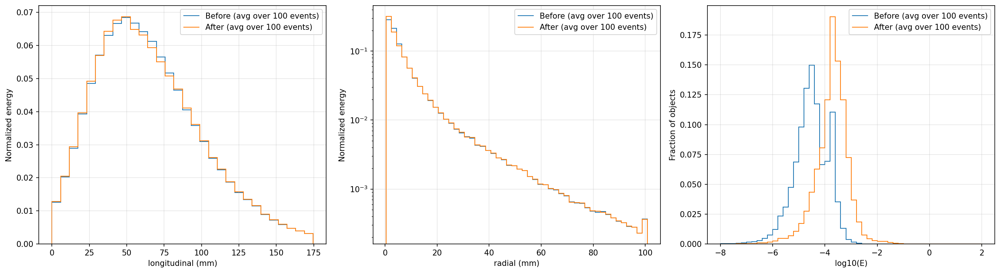
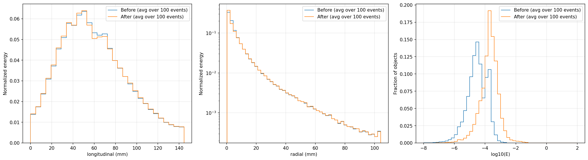
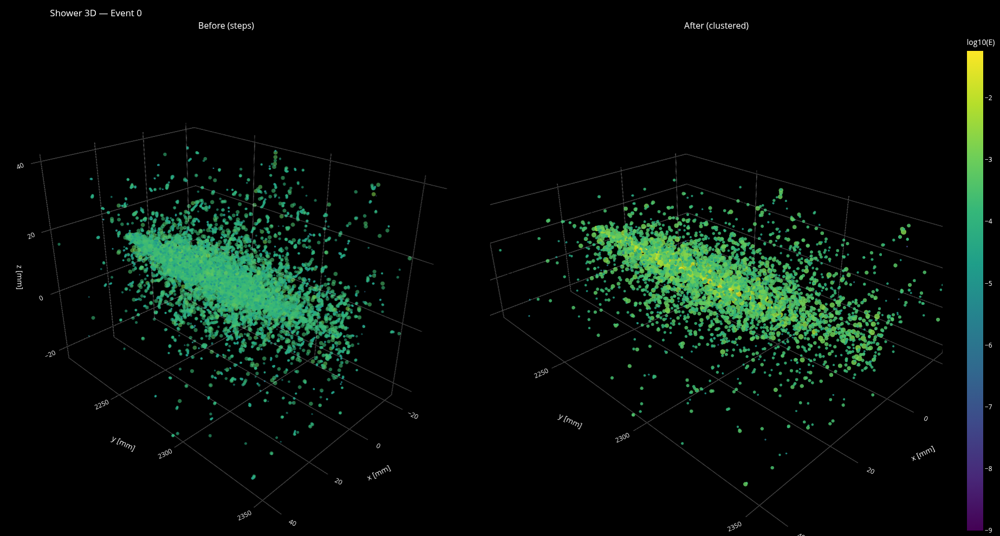

# Data-Representation-Optimisation-Algorithms


**Contributor:** Tarun Nandi


**Mentors:** Peter McKeown, Piyush Raikwar, Anna Zaborowska


**Organisation:** CERN–HSF


**Repository:**  <https://gitlab.cern.ch/fastsim/representation-optimisation-algorithms>


---


## Table of Contents


- [1. Problem Definition and Approach](#1-problem-definition-and-approach)


- [2. What I have done](#2-what-i-have-done)
    - [2.1 DBSCAN](#21-dbscan)
    - [2.2 CLUE-style](#22-clue-style)
    - [2.3 Grid Clustering](#23-grid-clustering)


- [3. Tooling for Evaluation](#3-tooling-for-evaluation)
    - [3.1 validate_clustering.py](#31-validate_clusteringpy)
    - [3.2 visualisation.py — side-by-side 3D viewer](#32-visualisationpy--side-by-side-3d-viewer)


- [4. Results](#4-results)
- [5. Discussion](#5-discussion)
- [6. Future Work](#6-future-work)
- [7. Conclusion](#7-conclusion)
- [8. Acknowledgements](#8-acknowledgements)


---


## 1. Problem Definition and Approach


### 1.1 Context


High-energy physics experiments such as those operated at the Large Hadron Collider (LHC) fundamentally rely on detailed and realistic simulations of particle interactions with the detector. This is a computationally expensive task, and with future detectors becoming more granular, this problem may get worse. Generative model-based simulations are in production to tackle this, but due to future high granularity detectors, training such models at scale while preserving calorimetric observables requires compact, accurate and detector geometry independent data representation


### 1.2 Problem


Geant4 exposes individual calorimeter **steps** (numerous, geometry‑agnostic). Retaining all steps is too computationally costly for training generative fast simulation models.


**Goal**: Given Geant4 steps for an event, construct a **compact point cloud** that:
- **greatly reduces** step count
- **preserves** calorimetric observables (longitudinal/radial profiles, step energy profiles, first/second moments, total energy).


### 1.3 Approach


I have implemented three different clustering strategies:


* **DBSCAN** per layer in a scaled (x,y,t) space, with an **adaptive core/tail** variant.
* **CLUE‑style** per layer aligning to the k4clue study
* **Grid-Clustering**: intrinsic **shower axis** (energy‑weighted PCA), **pseudo‑layers along the axis**, transverse **grid quantisation** with optional **energy‑aware CCL** merging (inspired by the pre-processing pipeline for caloclouds).


### 1.4 Success criteria


* **Compression**: Significant reduction in step counts.
* **Shower Preservations**: All calorimetric observables should be accurately preserved
* **Practicality**: Minimal dependency on detector geometry


---


## 2. What I have done


### 2.1 DBSCAN


#### Design
DBSCAN is a classical density-based method with two main parameters: a neighbourhood radius (epsilon) and a minimum neighbour count (min_samples). Because calorimeter showers develop along an axis (shower axis), with confirmation from my mentor, I ran DBSCAN layer-wise so that DBSCAN is applied to each layer one at a time instead of trying to cluster in a 3d space. This stabilises clustering (longitudinally), but this also means that we are relying on detector geometry, and hence this approach is not detector independent.


Layer decoding and grouping: We iterate over event_id → subdetector → layer, where the layer index is decoded from the readout cell identifier as:
```
layer = (cell_id >> 19) & 0x1FF
```


Feature space and metric:  Within each layer, we embed steps in a compact, unitless space so that distances are comparable across coordinates:
```
s = (x', y', t') = (x/5, y/5, (t - median_layer)/1)
```
Distances are Euclidean in this space. Dividing x and y by 5 mm makes them roughly “cell units”; centreing time by the layer median removes global offsets; dividing by 1 ns keeps numbers well scaled. This scaling allows us to include time in the distance metric and also makes a single epsilon reasonably transferable across layers.


**Standard DBSCAN pass:**  For a given epsilon (eps_scaled) and min_samples, a step is a core if it has at least min_samples neighbours within epsilon in each layer. Border points attach to reachable cores; points that are not density-reachable are labelled noise (-1). Cluster labels are then offset so they remain unique across the whole event.


**Adaptive core/tail variant (optional):**  One epsilon rarely serves both dense cores and sparse tails. To mitigate this, we:


- Compute an energy-weighted transverse centroid in the layer and energy-weighted distances r_i in (x,y).


- Find a quantile radius R_q that encloses an energy fraction q (default about 0.68). Hits with r <= R_q are tagged core; the rest are tail.


- Run DBSCAN twice: with a larger epsilon on the core set (eps_core = k_core * eps_scaled, e.g., k_core ≈ 1.8) and a smaller epsilon on the tail set (eps_tail = k_tail * eps_scaled, e.g., k_tail ≈ 0.6), keeping min_samples fixed.


- For each tail cluster, compute its centroid and attach it to the nearest core cluster if the distance is within the base eps_scaled; otherwise, retain it as a separate label. This keeps cores compact without erasing legitimate tails.


**Reduction to a point cloud**.


After labelling, each cluster (label ≥ 0) is reduced to a single representative point with:


- Position: energy-weighted 3D centroid of its member hits (computed back in physical x,y,z),
- Energy: sum over member energies,
- Time: minimum time


**Complexity**: typically **O(N log N)** per layer (KD‑tree); worst‑case O(N²).


#### Measured outcomes (summary)


* **Longitudinal**: roughly stable due to per‑layer processing, but **core shifts up to \~5 mm** in worst cases.
* **Radial**: **degrades significantly** (containment worsens); single ε lets dense cores connect early and **drags neighbours inward**. Reducing ε helps but hurts compression.
* **Performance**: \~**1 event/s**.
* **Detector/angle dependence**: per‑layer in detector `(x,y,t)` → **not** detector‑independent; behaviour should vary with incident angle.


**CLI**


```bash
python dbscan.py INPUT.h5 \
 --n_events 100 --eps_scaled 1.5 --min_samples 5 \
 --output clustered_dbscan.h5


# Adaptive
python dbscan.py INPUT.h5 \
 --n_events 100 --eps_scaled 1.5 --min_samples 5 --adaptive \
 --output clustered_dbscan_adapt.h5
```


---


### 2.2 CLUE-style


#### Design


After DBSCAN’s ε-sensitivity and core “inward drag,” I explored a density-peaks strategy to make cluster centres (seeds) explicit. In CLUE-style clustering, a point is a good seed if it is dense and well separated from any higher-density point. Followers then attach by “climbing” to their nearest higher-density neighbour. This often yields cleaner centres in crowded regions.


Layer-wise setup and features: As with DBSCAN, processing is layer-wise per(layer decoded from cell_id). To keep radii comparable across layers, we embed steps in a scaled transverse space only:
```
u = x' = x / 5        # ~cell units in x
v = y' = y / 5        # ~cell units in y
```


Local density (ρ). Build a cKDTree on (u, v). For each step, I defined a simple step-kernel density
```
rho[i] = 1 + 0.5 * count{ j != i | dist((u,v)i, (u,v)j) <= dc' }
```


where dc' = dc / 5 is the neighbour radius expressed in scaled units. The +1 ensures isolated points have non-zero density; the 0.5 softens the increment so ρ spreads more smoothly with occupancy. We compute ρ efficiently via query_ball_point (ball queries) and store neighbour counts.


**Separation (δ)**.We sort points by decreasing ρ. For each point i in that order, find among points with strictly higher ρ the nearest neighbour (Euclidean in (u,v)), but constrain the search to a bounded radius r_max ≈ k * dc' (k = 3) for robustness.
Let
```
nh[i] = argmin_{j: rho[j] > rho[i], dist(i,j) <= r_max} dist(i,j)
delta[i] = dist(i, nh[i])          # if found
```


If no higher-ρ neighbour is found within r_max, set delta[i] to a large appropriate (r_max) and leave nh[i] = None. This convention gives genuine isolated density peaks a large δ and keeps δ finite/stable.


**Seed and outlier classification.**


- Seeds are steps with: ```rho[i] >= rhoc and delta[i] >= deltac' (default deltac' = dc')```, guaranteeing that a seed is both locally dense and separated from any higher-ρ point.


- Outliers (optional): ```rho[i] < rhoc and delta[i] >= outlier_factor * dc'```. This labels sparse, far-from-centre points as outliers.


Fallback guarantee: If there are labelled followers but no seeds, promote the point with the largest rho[i] * delta[i] to a seed so every connected component can acquire a label.


**Follower assignment**.To assign followers, we traverse points again in descending ρ. If a point is already a seed, it gets a new label. Otherwise, repeatedly follow nh[] (nearest-higher-ρ links) until a seed (or already-labelled point) is reached; inherit that label. Because links always go to higher ρ, this ascent terminates.


**Reduction to a point cloud.** For each non-outlier cluster:


- Position: energy-weighted 3D centroid of constituent hits (computed back in physical (x,y,z)),
- Energy: sum of member energies,
- Time: minimum time


**Complexity**: KD‑tree build **O(N log N)**;


#### Measured outcomes (summary)


* **Longitudinal**: more stable than DBSCAN (typical core shift ≲ **1 mm**), but non‑zero.
* **Radial**: **persistent degradation** across reasonable `(dc, rhoc, deltac)`; larger `dc` worsens tails by **several mm**; smaller `dc` fragments. **Outlier pruning** tuned for energy‑weighted hits can drop legitimate **step‑level** tails → **energy loss**.
* **Performance**: \~**0.25 event/s** (≈4 s/event).
* **Detector/angle dependence**: per‑layer `(x,y)` without axis transform → **not** angle‑robust or detector‑independent.


**CLI**


```bash
python clue_based.py INPUT.h5 \
 --n_events 100 --dc 15.3 --rhoc 5.0 \
 --output clustered_clue.h5
```


---


### 2.3 Grid Clustering


#### Design
After DBSCAN’s ε‑sensitivity and CLUE’s radial tail erosion in a detector‑layer frame, I designed a geometry‑agnostic, angle‑robust alternative with explicit geometric control. The method works in a natural shower frame derived from the steps and then applies a fixed grid per axis‑aligned pseudo‑layer. This prevents the radius‑driven “inward drag” that occurs when density thresholds bridge across gaps. The overall idea was inspired by the preprocessing stage of the CaloClouds paper, which also projects granular grids onto each layer.


**natural frame via energy‑weighted PCA**


For each event, we estimate a robust shower axis from the top energy quantile (default ≈70%) to make sure that the shower axis is not skewed by outliers


- Weighted centroid: ```O = sum(E_i * x_i) / sum(E_i) (with x_i ∈ R^3)```
- Weighted covariance: ```C = sum(E_i * (x_i − O)(x_i − O)^T) / sum(E_i)```


The principal eigenvector of C is the axis a. Choose ```e1 ⟂ a```  and set ```e2 = a × e1``` to form a right‑handed basis {a, e1, e2}.


Project hits: ```w = (x − O)·a, u = (x − O)·e1, v = (x − O)·e2```


This alignment uses only step positions and energies, where no layer information or detector geometry is required, so it is detector‑independent and angle‑robust by construction.


**Pseudo‑layers along the axis**


To make our pseudo layers, we slice the shower along w(shower axis) with a Freedman–Diaconis bin width ```h = 2 * IQR(w) * n^(−1/3)````, then clamp h to [fd_min_mm, fd_max_mm] to avoid inappropriate widths for tiny/spiky samples. Each hit gets an integer index ```L = round(w / h)````. ```If n < 5 or IQR(w) ≈ 0```, fall back to a fixed safe h within the clamp.


**Transverse quantisation per pseudo‑layer**


Within each L(transverse plane), we project our granular grid of size = grid_trans_mm (e.g., 0.85–3.0 mm):
```
i = round(u / Δ)   # column index
j = round(v / Δ)   # row index
cell = (L, i, j)
```
**For each occupied cell:**


We store E_sum = sum(E_i), hit indices (or running sums for centroids), optional 3×3 local‑median cache for merge gates. A hash map keyed by (L,i,j) keeps memory compact because occupied cells B << N.


**Optional energy‑aware CCL merging**


If second_stage is enabled, then we run connected components over occupied cells using 4‑ or 8‑neighbourhood (ccl4/ccl8). Merge neighbouring cells p,q only if both tests pass:
```
Local energy gates:
E_p >= alpha * median_3x3(E around p) and
E_q >= alpha * median_3x3(E around q).
```
```
Energy similarity:
min(E_p, E_q) / max(E_p, E_q) >= rho.
```
Typical defaults: alpha = 0.60, rho = 0.50. This prevents weak bridges in low‑energy outskirts and discourages fusing very unequal neighbours. We implement CCL via breadth-first search through the small occupied set of cells.


**Reduction to a point cloud**


For each cell (no CCL) or merged component:


- Position: energy‑weighted 3D centroid of the original steps in the group (output points live in real 3D, not at grid corners)
- Energy: sum of member energies,
- Time: minimum time


**Complexity**: projections/binning **O(N)**; CCL over occupied bins ≈ **O(B+E)**


#### Measured outcomes (summary)


* With **fine grid** (e.g., **0.85 mm**) and **no second stage**, **longitudinal & radial profiles** are **almost perfectly preserved**. Fixed per‑slice tessellation prevents the **inward drag** seen with radius‑based clustering.
* At **3 mm**, shapes remain **very good** with stronger compression; at **10 mm**, visible degradation appears (core shift, radial distortion), but deviations remain **sub‑cell** compared to a \~**5 mm** readout pitch.
* **CCL4** on top of 0.85 mm: **extra compression** at **minimal cost**; **CCL8** compresses more but starts to harm cores/tails → choose **CCL4** when fidelity is priority.
* **Throughput**: **\~3–4 events/s** (fastest).
* **Detector independence & angle robustness**: uses only hits to define the axis and slices along it; behaviour is unchanged under incident‑angle and readout changes.


#### Testing on different angles
I did a simple check on whether this grid clustering approach would adapt to showers that develop at a different angle. I did this by calling run_sim.py with the parameters:
```
--gun-pos = 10 2150 10
--gun-dir = 0 0.866 0.5


```
Essentially, I only changed the direction of the gun, and since this approach calculates the shower axis (data-driven) and clusters in perpendicular planes to the shower axis, I also observed nearly perfect preservation in the longitudinal and radial profiles, proving that this approach scales well to other showers as well.





**CLI**


```bash
python grid_clustering.py INPUT.h5 \
 --n_events 100 --grid_trans_mm 0.85 \
 --fd_min_mm 2.0 --fd_max_mm 10.0 \
 --energy_quantile_for_axis 0.70 --second_stage ccl4 \
 --bridge_energy_factor 0.60 --similarity_ratio 0.50 \
 --output clustered_grid.h5
```


---


## 3. Tooling for Evaluation


### 3.1 `validate_clustering.py`


**Purpose**: objective, detector‑agnostic validation used continuously while developing.


**Per event**


1. **Axis from BEFORE only** (energy‑weighted PCA; optional refinement by trimming outliers).
2. **Cylindrical frame** around the axis: `long`, `r`, `phi` from projections; compute **energy‑weighted circular mean** of `phi` on BEFORE; rotate both BEFORE/AFTER so `phi=0` matches BEFORE.
3. **Shared cuts from BEFORE**: derive `[q_low, q_high]` on BEFORE only; apply **identically** to AFTER.
4. **Profiles (stairs)**: energy‑weighted longitudinal and radial profiles, **per‑event normalised**, then averaged across events.
5. **Counts** in `log10(E)` (object count, per‑event normalised).
6. **Energy‑weighted raw moments**: `<L>`, `<L^2>`, `<r>`, `<r^2>` (histograms across events).
7. **Containment & widths**: Δ medians (After − Before) for **R50/80/90** and **w10/50/90**.
8. **Energy closure** `E_after / E_before` (no cuts) and **f\_keep** (fraction of energy kept inside shared cuts).


**Outputs**: `comparison.png` (profiles + step energy profile), `comparison_moments.png` (moment distributions), and printed metrics.


**Why it mattered**:
Revealed **DBSCAN**’s radial over‑merging and longitudinal drift, **CLUE**’s persistent radial loss (and outlier handling pitfalls on steps), and the **Grid** method’s near‑perfect profiles at 0.85 mm with a clean fidelity/compression dial via grid size and CCL choice.


**CLI**


```bash
python validate_clustering.py BEFORE.h5 AFTER.h5 \
 --n_events 100 --q_low 0.01 --q_high 0.99 \
 --anchor before_min --output validation_outputs
```





---


### 3.2 `visualisation.py` — side‑by‑side 3D viewer


**Purpose**: quick, honest before/after sanity check to accompany validation.


**Design for fairness**


* **Energy‑weighted quantile framing** computed on **BEFORE and AFTER**; identical x/y/z ranges in both panels.
* **Shared colour scale** in **log10(E)**; share camera/aspect across panels.
* **Size by energy** (percentile cap); AFTER markers slightly larger for contrast.
* **Event/subdet** selection ensures the same event is compared in both files.


**What it highlights**: inward drag (DBSCAN), broken tail topology or over‑pruning (CLUE), and shape preservation vs blockiness/over‑merging choices (Grid with different cell sizes / CCL4 vs CCL8).


**CLI**


```bash
python visualisation.py BEFORE.h5 AFTER.h5 \
 --event <id> [--subdet 0] \
 --qlo 0.02 --qhi 0.98 \
 --output compare_event.html
```

---


## 4. Results
I have attached the results of some parameter sweeps I did with each clustering algorithm, which contain more information on how parameters affect the preservation of calorimetric observables


[Results](Results/Results.pdf)


---


## 5. Discussion


### DBSCAN


**What it does well:** Strong compression and simple tuning (`ε`, `min_samples`).


**What goes wrong:** Using a single `ε` per layer lets dense regions cluster early: core points connect and **pull border points inward**. This produces  **mm-level longitudinal core shifts** (worst cases a few mm) and  **radial distortion** — excess energy near the core and a deficit in the tails, i.e., **ΔR80/90** typically **negative** (artificially tighter containment).


**Why adaptive `ε` isn’t enough:** Splitting into core/tail with different `ε` values **reduces** the effect but doesn’t remove it — tail clusters still get attached back to cores or merged across small gaps. Tight `ε` avoids the drag but **fragments** the shower and hurts compression; loose `ε` compresses well but **distorts** profiles.


### CLUE-style


**What it does well:** `ρ–δ` seeds enforce that centres are both **dense** and **well-separated**, so the **longitudinal peak is more stable** (smaller core shift than DBSCAN).


**What goes wrong:** Followers attach by merging to their **nearest higher-ρ** neighbour **within a detector layer (x,y)**. This can **bridge across gaps** and again **pull tails inward**, leaving a deficit at large radii. Across reasonable `(dc, rhoc, deltac)` settings, **ΔR80/90** remains **non-zero** (often negative).


**Outlier pitfall on steps:** If you enable the outlier rule, sparse but **physically real** tail steps can be dropped (the density is **count-based**, not energy-based), leading to **energy loss** even when seeds look clean.


### Grid (axis-aligned)


**What it does well:** Aligns to a **shower-intrinsic axis** (energy-weighted PCA), slices into **pseudo-layers** along that axis, and applies a **fixed transverse grid**. The grid acts as a **hard spatial gate**: steps only merge if they **co-occupy a cell** (or pass **local, energy-aware** CCL rules).


**shower preservation vs grid cell size:**
- **grid_trans_mm = 0.85–2 mm:** longitudinal and radial profiles **match baseline** within statistical fluctuations; **ΔR50/80/90 ≈ 0**.
- **grid_trans_mm≈ 3 mm:** still **very good** fidelity with stronger compression.
- **grid_trans_mm ≈ 10 mm:** Profiles worsen  but deviations are **sub-cell** and often below a typical ~5 mm readout pitch.


**CCL choice:** **CCL4** (4-neighbour) gives extra compression at **minimal** shape cost; **CCL8** (8-neighbour) is more aggressive — diagonal merges can start to degrade both longitudinal and radial profiles.


---


## 6. Future Work
- Validate at the readout level (less sensitive). Aggregate clustered point clouds into simulated readout cells (including realistic thresholds/noise). Because sub‑cell deviations are often below readout cell size, this should allow for more aggressive Grid settings (larger grid_trans_mm or CCL) without observable physics loss.


- Extend to hadronic showers (HCAL). Investigate pseudo-layering approaches within the HCAL. How do you adapt to having multiple cores within the shower?


- Vary detector cell sizes and shapes. Explore non‑square tessellations (hexagonal) aligned with known segmentation. Implement shape‑aware CCL (neighbourhoods and similarity computed in the appropriate metric) and study robustness across cell sizes.


## 7. Conclusion


We benchmarked three clustering algorithms for compressing Geant4 calorimeter steps into point clouds. Despite tuning, **DBSCAN** and **CLUE** **fail** the physics‑fidelity target—especially for **radial** observables—while the **axis‑aligned Grid** method **preserves** both **longitudinal and radial** profiles at fine grid sizes and offers the best **performance** with **detector‑independent, angle‑robust** behaviour. This makes the Grid approach the recommended **production baseline** for point‑cloud construction in fast simulation pipelines.


---


## 8. Acknowledgements


I am deeply grateful to my mentors — Peter McKeown, Piyush Raikwar, and Anna Zaborowska — for their generous guidance, incisive reviews, and steady encouragement throughout this project. Their feedback shaped the design of the clustering algorithms, the validation methodology, and the interpretation of results.


---


## References:
- K4Clue study:<https://cds.cern.ch/record/2882302/files/Publication.pdf>
- CaloClouds study:<https://arxiv.org/pdf/2305.04847v2>


